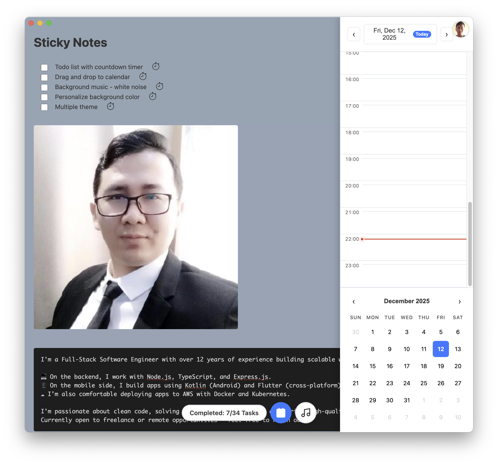

# StickyTop - Rich Sticky Notes

A beautiful Electron application for creating rich text sticky notes that stay on top of other windows.

## Features

v1
- todo list + simple note + countdown.
- analytic
- beautiful view
- premium template.
- gan thong tin tracker

v2 

- export notion
- export doto to other task list.
- calendar event create

- reminder.
- static 
- archive.
- previous changes (nhu Google Doc)
- email reminder weekly.
- code chuc nang subscription.
  

## Installation

---

Bước 1: Truy cập Google Cloud Console
Vào https://console.cloud.google.com
Chọn project của bạn (hoặc tạo mới)

Bước 2: Vào OAuth 2.0 Client IDs

Nho chon WEBAPP - not desktop app

Vào APIs & Services → Credentials
Tìm OAuth 2.0 Client IDs trong danh sách
Click vào client ID bạn đang dùng (hoặc tạo mới)

